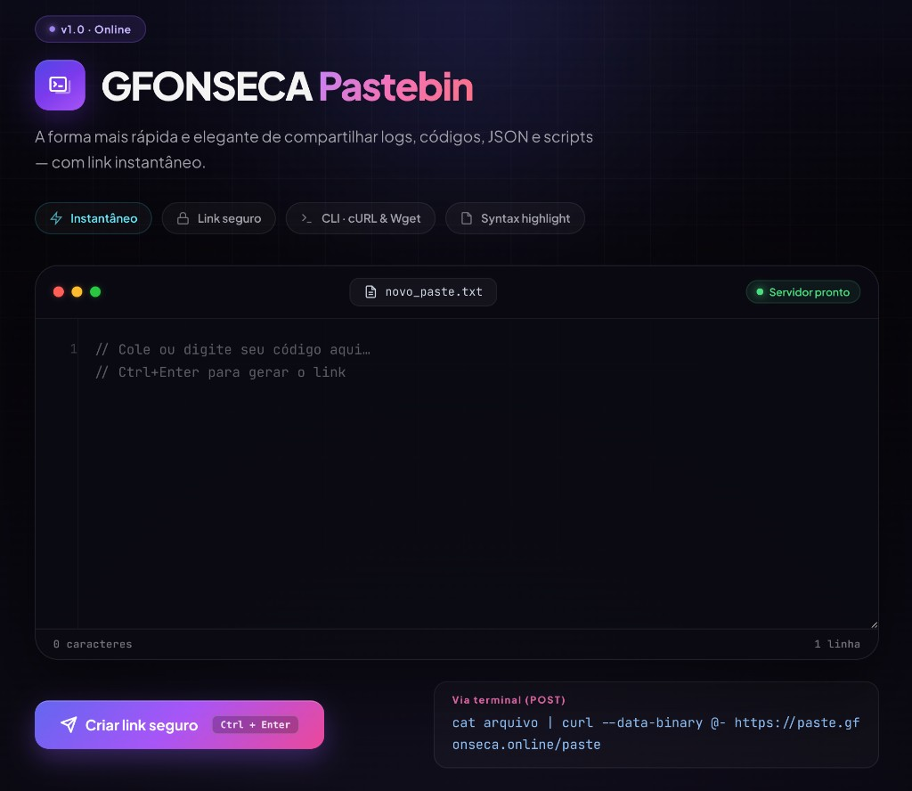

<div align="center">

# ✨ GFONSECA Pastebin

**Share code, logs, JSON & scripts in seconds — from the browser or straight from your terminal.**

[](https://paste.gfonseca.online)
[](https://go.dev/)
[](data_go/Dockerfile)
[](#license)

<br>



<br>

[🚀 Live Demo](https://paste.gfonseca.online) · [⚡ Quick Start](#-quick-start) · [🖥️ CLI Usage](#-cli--api) · [🐳 Docker](#-docker)

</div>

---

## 💡 Why GFONSECA Pastebin?

A **fast, beautiful, zero-friction** pastebin built for developers who live in the terminal and appreciate a polished UI.

| | |
|:---:|:---|
| ⚡ | **Instant links** — paste, submit, share |
| 🔒 | **Secure by design** — random IDs, plain HTTP API |
| 🌍 | **EN / PT** — auto-detects browser language + manual toggle |
| 🖥️ | **CLI-first** — pipe output directly with `curl` or `wget` |
| 🎨 | **Syntax highlight** — Prism.js powered viewer |
| 📦 | **10 MB** per paste · **Docker-ready** · **no external DB** |

---

## ✨ Features

<table>
<tr>
<td width="50%">

### 🌐 Web Experience
- IDE-style editor with **line numbers**
- Character & line counters
- **`Ctrl + Enter`** shortcut
- Premium dark UI with glassmorphism
- Result card with copy & CLI commands

</td>
<td width="50%">

### 🛠️ Developer Experience
- **POST** pastes from the terminal
- **RAW** endpoint (`/{id}/raw`)
- Auto raw mode for **cURL / Wget**
- Syntax highlighting on view page
- Static Go binary — deploy anywhere

</td>
</tr>
</table>

---

## ⚡ Quick Start

### 1️⃣ Run locally

```bash
cd data_go
go mod init pastebin   # first time only
go run .
```

Open **[http://localhost:8080](http://localhost:8080)** 🎉

### 2️⃣ Create a paste from the terminal

```bash
echo "Hello, world!" | curl --data-binary @- http://localhost:8080/paste
```

```text
https://paste.gfonseca.online/abc123def4567890
```

### 3️⃣ Fetch it back

```bash
curl -L https://paste.gfonseca.online/abc123def4567890
```

---

## 🖥️ CLI & API

### Create (POST)

```bash
cat error.log | curl --data-binary @- https://paste.gfonseca.online/paste
```

### View

| Action | Command |
|--------|---------|
| 🌐 Browser (HTML) | `https://paste.gfonseca.online/{id}` |
| 📄 Plain text (RAW) | `https://paste.gfonseca.online/{id}/raw` |
| 📡 cURL | `curl -L https://paste.gfonseca.online/{id}` |
| 📡 Wget | `wget -qO- https://paste.gfonseca.online/{id}` |

> 💡 Requests from **cURL** or **Wget** automatically receive raw content — no flags needed.

### Routes

| Method | Route | Description |
|:------:|:------|:------------|
| `GET` | `/` | Create interface |
| `POST` | `/paste` | Create a new paste |
| `GET` | `/{id}` | View paste (HTML) |
| `GET` | `/{id}/raw` | Plain text content |
| `GET` | `/static/*` | Static assets |

---

## 🐳 Docker

```bash
cd data_go
docker build -t gfonseca-pastebin .
docker run -d \
  --name pastebin \
  -p 8080:8080 \
  -v pastebin-data:/app/data \
  gfonseca-pastebin
```

The app listens on port **8080**.

---

## 🧱 Stack

| Layer | Technology |
|:-----:|:-----------|
| ⚙️ Backend | Go 1.23 · `net/http` |
| 🎨 Frontend | HTML · CSS · JavaScript |
| 🌈 Highlighting | Prism.js |
| 🌍 i18n | EN / PT · browser detection |
| 🚢 Deploy | Docker multi-stage · Alpine |

---

## 📁 Project Structure

```
data_go/
├── main.go              # HTTP server & handlers
├── Dockerfile           # Containerized build
├── templates/
│   ├── index.html       # Create page
│   └── view.html        # View page
├── static/
│   ├── style.css        # UI styles
│   ├── i18n.js          # EN / PT translations
│   └── prism*.js/css    # Syntax highlighting
└── data/                # Stored pastes (runtime)
```

---

## ⚙️ Configuration

| Setting | Default | Description |
|:--------|:-------:|:------------|
| Port | `:8080` | HTTP server port |
| Data dir | `./data` | Paste storage |
| Max size | **10 MB** | POST body limit |

---

## 🗺️ Roadmap

- [ ] Automatic paste expiration
- [ ] Light / dark theme toggle
- [ ] Auto language detection for syntax highlight
- [ ] Optional auth for private pastes
- [x] EN / PT UI with browser language detection

---

## 👤 Author

**Guilherme Fonseca**

[](https://paste.gfonseca.online)

---

## 📄 License

TBD.

---

<div align="center">

⭐ Star this repo if you find it useful!

</div>
